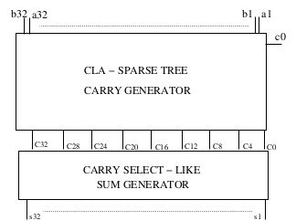
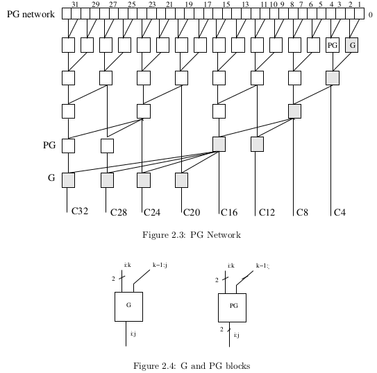

# Pentium 4 Adder (P4-Adder) - GitHub Presentation

## Overview
The **Pentium 4 Adder (P4-Adder)** is a high-performance, low-latency adder implementation based on the architecture used in the Intel Pentium 4 microprocessor. It uses a combination of **Carry Select Adders (CSA)** and a **Sparse Tree Carry Generator** to achieve efficient, parallelized carry generation and summation, making it ideal for high-speed applications like processor designs where arithmetic operations need to be performed with minimal delay.

The following pictures illustrate the block scheme and carry generator architecture:

- **Block Scheme of the Architecture**:
  

- **Carry Generator in Detail**:
  

## Working Principle
The **P4-Adder** is structured into two main sub-blocks:

1. **Carry Select Adder (CSA)**:
   - Generates the sum by selecting between multiple carry possibilities.
   - The carry is selected from the results produced by the carry generator and used in the sum computation process.
   - The number of CSAs in the adder is determined by the width of the inputs (`NBIT`) and the block size (`NBIT_PER_BLOCK`).

2. **Sparse Tree Carry Generator**:
   - Receives the inputs `A`, `B`, and `Cin` (carry-in).
   - Generates a carry every `NBIT_PER_BLOCK` bits, propagating the carries through a sparse tree structure.
   - The first carry output (`C0`) generated by the carry generator is used as the initial carry for the sum computation.
   - The final carry output (`C_NBIT`) becomes the final carry-out (`Cout`) produced by the P4-Adder.

These two components work together to provide a high-speed, low-latency adder by minimizing the propagation delay typically seen in traditional adders.

## Input Signals
The **P4-Adder** has the following input signals:

- `A`: An `NBIT`-bit input signal.
- `B`: An `NBIT`-bit input signal.
- `Cin`: The carry-in signal, which is a single-bit input.

## Output Signals
The **P4-Adder** provides the following output signals:

- `Sum`: An `NBIT`-bit output signal representing the computed sum.
- `Cout`: The carry-out signal, which is a single-bit output indicating the final carry after the addition.

## Features
- **High Speed**: Optimized for low latency through the combination of CSA and sparse tree structures.
- **Scalability**: Supports variable input bit widths (`NBIT`) and customizable block sizes (`NBIT_PER_BLOCK`).
- **Efficient Carry Generation**: Utilizes a sparse tree for reduced propagation delay.

## Applications
The **P4-Adder** is ideal for:
- Processor arithmetic units
- High-speed digital signal processing (DSP)
- Hardware accelerators

## Usage
To integrate the **P4-Adder** into your project, follow these steps:
1. Clone the repository:
   ```bash
   git clone https://github.com/your-repo/p4-adder.git
   ```

2. Include the required source files in your hardware design.

3. Configure the parameters:
   - `NBIT`: Set the desired bit width of the inputs.
   - `NBIT_PER_BLOCK`: Set the block size for the sparse tree carry generator.

4. Simulate and test the design to verify its performance in your application.
   ```bash
   cd sim/
   do simulation.tcl
   ```

## License
This project is licensed under the MIT License. See the [LICENSE](LICENSE) file for details.

---
For further details, please refer to the [documentation](docs/index.md) or contact the maintainers through [GitHub Issues](https://github.com/your-repo/p4-adder/issues).

